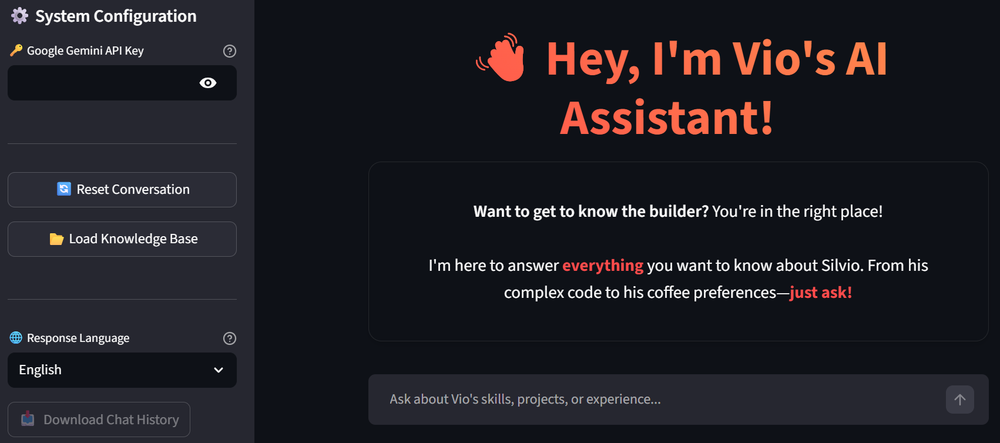
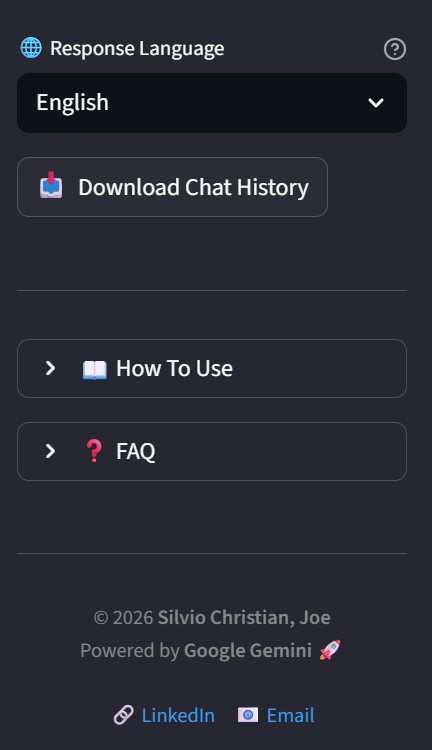
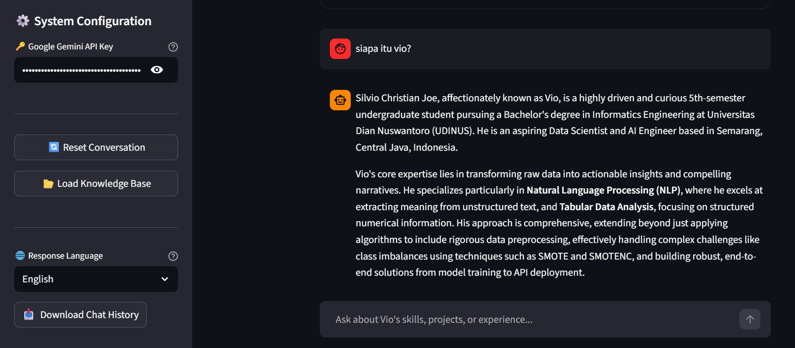

# 🚀 Chat with Vio (Portfolio AI Assistant)


## 📌 Overview
**Chat with Vio** is a personalized AI Assistant designed to showcase the professional profile of **Silvio Christian Joe**. 

Powered by **Google Gemini 2.5 Flash** and **RAG (Retrieval Augmented Generation)** technology, this application allows recruiters and visitors to "chat" with Silvio's resume. Instead of reading a static CV, users can ask questions like *"What is Vio's tech stack?"* or *"Tell me about his data science projects,"* and get accurate, cited answers derived directly from his profile data.

## ✨ Key Features

### 🧠 Specialized RAG Architecture
Unlike generic chatbots, this system is grounded in a specific knowledge base (`silvio_profile.json`).
* **Vector Search:** Uses **FAISS** to index Silvio's profile into vector embeddings.
* **Contextual Retrieval:** Retrieves only the relevant parts of the profile to answer specific user queries.

### 📊 Transparent RAG Analytics (Similarity Score)
To demystify the AI's reasoning, the app includes a "Debug Mode" hidden within an expander for every answer.
* **Metric Visualization:** Calculates and displays the **L2 Distance Score** (Euclidean) for each retrieved document.
* **Contextual Insight:** Shows the exact source snippet used and its mathematical relevance, where a **lower score indicates a stronger match** (e.g., 0.5 is closer than 1.0), ensuring full transparency of the retrieval process.

### 🌐 Strict Language Enforcement
Features a custom "Translator-Representative" prompt injection.
* **User Control:** Select **English** or **Indonesian** in the sidebar.
* **Behavior:** The AI acts as a bilingual representative. Even if the source data is in English, it will fluently answer in Indonesian if selected (and vice versa) without losing context.

### 📱 Responsive & Modern UI
* **Custom CSS:** Injects specific media queries to ensure the interface looks perfect on **Laptops, Tablets, and Mobile phones**.
* **Interactive Elements:** Features custom HTML cards, toast notifications (`st.toast`), and a polished sidebar layout.

### 🛡️ Anti-Hallucination & Safety
* **Strict Prompt Engineering:** The AI is instructed to **ONLY** answer based on the provided context. If asked about unknown facts (e.g., "Can Vio fly a plane?"), it politely declines rather than making things up.
* **Error Handling:** Robust handling for API Quota limits (429), Invalid API Keys, and content safety filters.

### 💾 Session Management
* **Chat History Export:** Users can download the entire conversation as a JSON file for reference.
* **State Preservation:** Uses `st.session_state` to maintain chat history and vector stores even when interacting with UI buttons.

## 🛠️ Tech Stack
* **LLM:** Google Gemini 2.5 Flash (`gemini-2.5-flash`).
* **Framework:** Streamlit.
* **Orchestration:** LangChain (`ConversationalRetrievalChain`).
* **Vector Database:** FAISS (CPU).
* **Embeddings:** Google Generative AI Embeddings (`models/gemini-embedding-001`).
* **Data Source:** JSON-based textual profile.

## 📦 Installation

1.  **Clone the Repository**
    ```bash
    git clone [https://github.com/viochris/personal-ai-assistant.git](https://github.com/viochris/personal-ai-assistant.git)
    cd personal-ai-assistant
    ```

2.  **Install Dependencies**
    ```bash
    pip install -r requirements.txt
    ```

3.  **Prepare Data**
    Ensure you have your profile data stored in:
    `data/silvio_profile.json`

4.  **Run the Application**
    ```bash
    streamlit run app.py
    ```

## 🚀 Usage Guide

1.  **Setup:**
    * Get your API Key from [Google AI Studio](https://aistudio.google.com/).
    * Enter the key in the sidebar configuration.
2.  **Initialize:**
    * Click the **"📂 Load Knowledge Base"** button.
    * *Wait for the "System is ready" toast notification.*
3.  **Customize:**
    * Select your preferred **Response Language** (English/Indonesian).
4.  **Chat:**
    * Ask questions like *"What are your skills?"* or *"How can I contact you?"*.
5.  **Export:**
    * Click **"📥 Download Chat History"** at the bottom of the sidebar to save the session.

## 📷 Gallery

### 1. Landing Interface
  
*The clean, user-friendly landing page welcoming users to the assistant. It features a clear call-to-action for initializing the secure environment.*

### 2. Comprehensive Sidebar Controls
  
*The remaining part of the sidebar configuration that is not visible in the Home UI screenshot.*

### 3. Interactive Chat & Context
  
*The core experience in action. The chat interface enables natural language queries, displaying precise answers derived directly from the uploaded content.*

## ⚠️ Limitations
* **Session Volatility:** Since FAISS is stored in RAM, refreshing the browser will clear the conversation and requiring a reload of the Knowledge Base.
* **Static Data:** The AI only knows what is written in the `silvio_profile.json` file. It does not browse the live internet.

---
**Author:** [Silvio Christian, Joe](https://www.linkedin.com/in/silvio-christian-joe)
*"Turning a static CV into an interactive conversation."*
